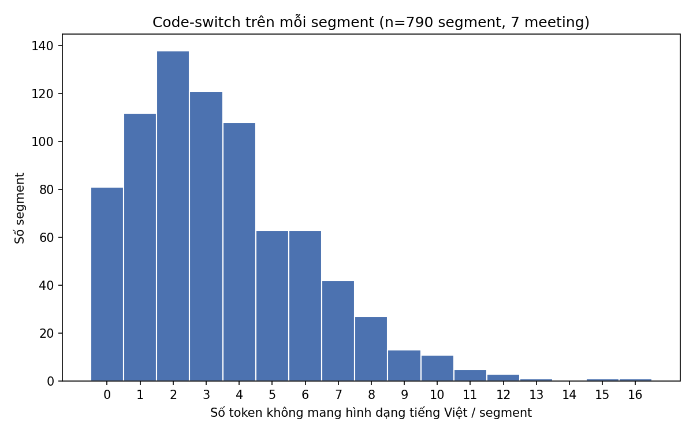
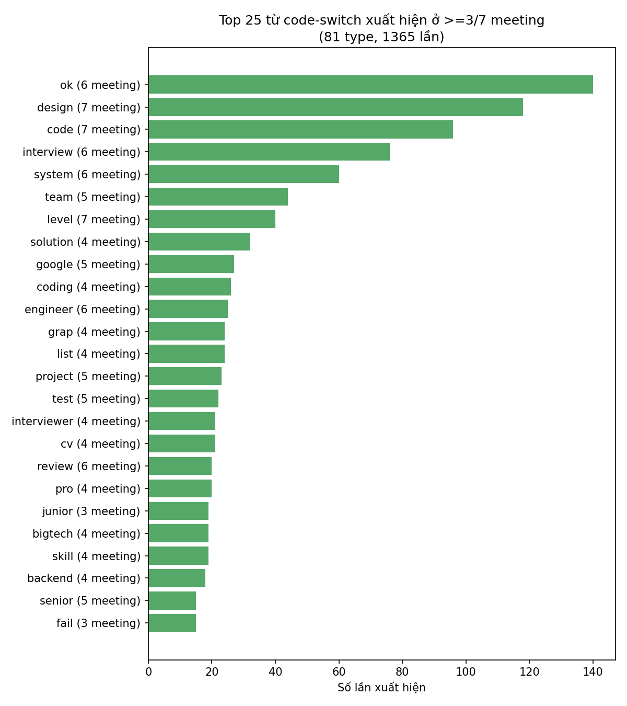
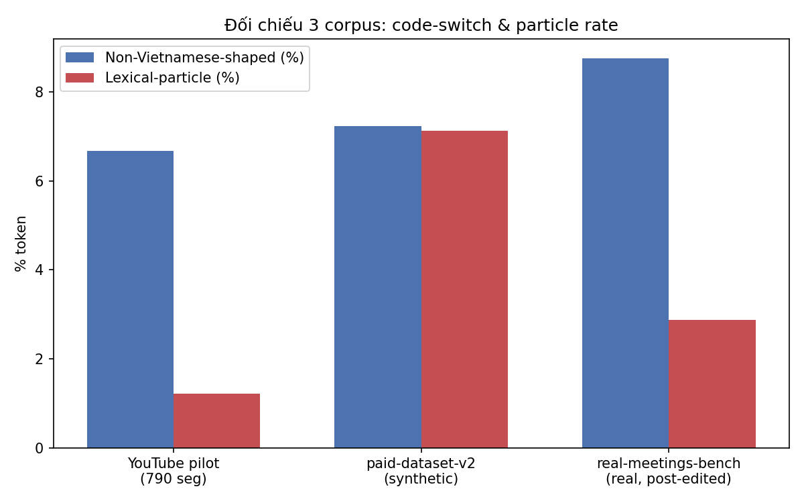
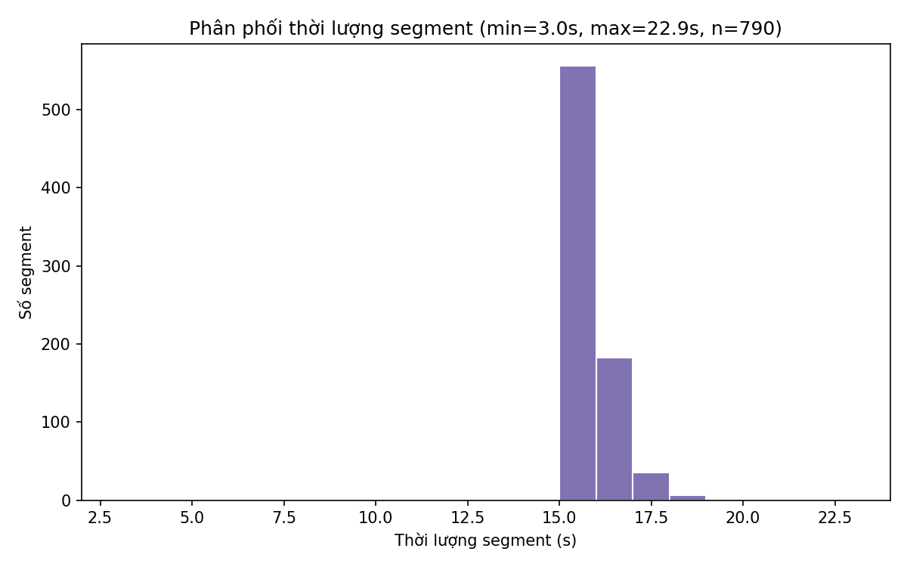
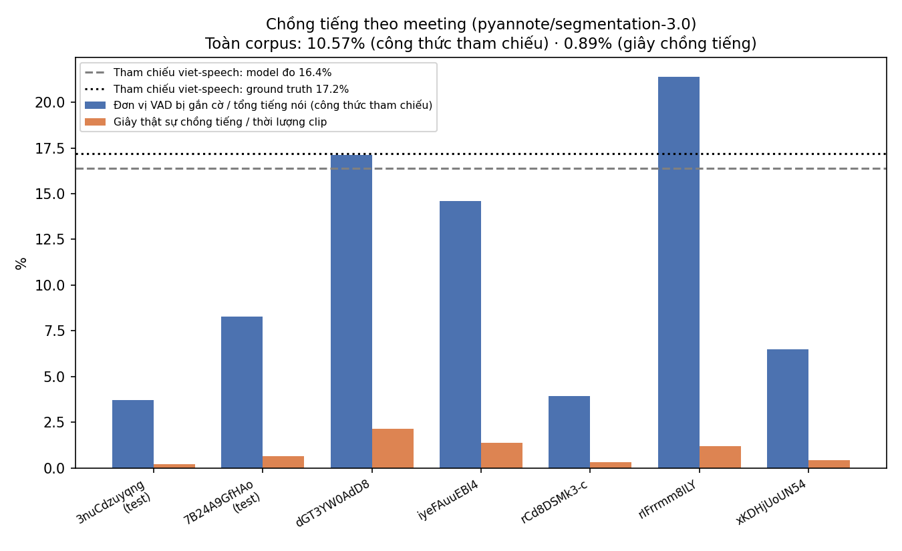
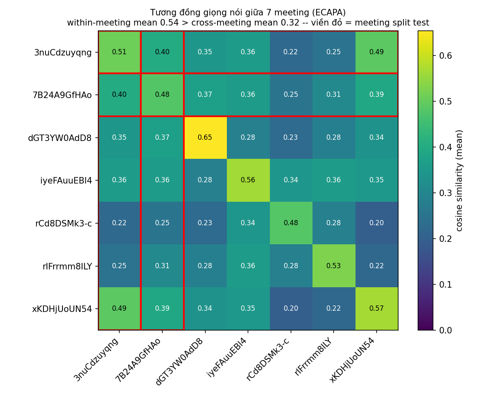

# Báo cáo dữ liệu YouTube pilot

> **Phạm vi:** `dataset/youtube-meetings/` — 7 video YouTube, đã sàng lọc, tải, cắt
> segment, **đã soát tay 790/790**.
> **Tính chất:** báo cáo chỉ trình bày số liệu đã đo và cách đo. Không có mục khuyến nghị.
>
> **Mọi số liệu trong báo cáo này đo trên nhãn nháp, trước lượt soát tay.** Báo cáo viết
> 2026-08-12, lượt soát hoàn tất sau đó. Các con số về code-switch, từ, filler và ví dụ lỗi
> nhãn vì thế mô tả **bản nháp `google_asr`**, không mô tả nhãn cuối. Trạng thái nhãn cuối ở
> [mục 11](#11-trạng-thái-nhãn); đo lại trên nhãn đã soát là việc chưa làm.

### Số liệu chính

| Chỉ số | Giá trị | Chi tiết |
|---|---:|---|
| Meeting | **7** | [Mục 2](#2-nguồn) |
| Segment | **790** | 228 `test` / 562 `demo` — [Mục 5](#5-cách-chia-testdemo) |
| Thời lượng | **207,42 phút** (3,46 giờ) | [Mục 8](#8-đặc-tính-segment) |
| Từ | **41.210** | [Mục 6](#6-code-switch) |
| Code-switch | **6,67%** token · **89,7%** segment | [Mục 6](#6-code-switch) |
| Chồng tiếng | **10,57%** (công thức tham chiếu) · **0,89%** (giây thật) | [Mục 9](#9-chồng-tiếng) |
| Tương đồng giọng | trong-meeting **0,54** > giữa-meeting **0,32** | [Mục 10](#10-trùng-người-nói-giữa-test-và-demo) |
| Nhãn đã soát | **790 / 790** | [Mục 11](#11-trạng-thái-nhãn) |

### Mục lục

1. [Tóm tắt](#1-tóm-tắt) · 2. [Nguồn](#2-nguồn) · 3. [Kiểm kê](#3-kiểm-kê) ·
4. [Quy trình](#4-quy-trình) · 5. [Cách chia test/demo](#5-cách-chia-testdemo) ·
6. [Code-switch](#6-code-switch) · 7. [Đối chiếu 3 corpus](#7-đối-chiếu-3-corpus) ·
8. [Đặc tính segment](#8-đặc-tính-segment) · 9. [Chồng tiếng](#9-chồng-tiếng) ·
10. [Trùng người nói](#10-trùng-người-nói-giữa-test-và-demo) ·
11. [Trạng thái nhãn](#11-trạng-thái-nhãn)

---

## 1. Tóm tắt

Corpus gồm **7 meeting, 790 segment, 207,42 phút (3,46 giờ), 41.210 từ**. Nhãn xuất phát
từ nháp ASR của Google (`google_asr`) rồi được người soát tay **toàn bộ 790/790 record**.
Số liệu bên dưới đo trên bản nháp, trước lượt soát. Cả 7 video được sàng lọc qua 3 luật ở
[mục 2](#2-nguồn) và đều được nhận.

**Ba nhóm số liệu đã đo:**

| Nhóm | Kết quả | Ghi chú |
|---|---|---|
| **Code-switch** | 6,67% token không mang hình dạng tiếng Việt, xuất hiện ở 89,7% segment | Thấp hơn cả hai corpus đối chiếu (`paid-dataset-v2`, `real-meetings-bench`) trên cùng chỉ số |
| **Chồng tiếng** (`pyannote/segmentation-3.0`) | **10,57%** theo đúng công thức của số tham chiếu 16,4%/17,2%; **0,89%** nếu tính số giây thật sự có hai người nói cùng lúc | Hai chỉ số **không thay thế nhau**; chỉ chỉ số thứ nhất so được với tham chiếu |
| **Trùng người nói `test`/`demo`** (ECAPA embedding) | Trong-meeting 0,54 > giữa-meeting 0,32 → **cổng kiểm đạt** | Nhưng 1 meeting `demo` (`xKDHjUoUN54`) tương đồng cao bất thường với cả 2 meeting `test`; một số cụm lẫn cả `test` và `demo` |

> **Hai hạn chế lớn nhất hiện tại:** nhãn của cả hai phía train/test xuất phát từ cùng một
> nguồn ASR, và chỉ một người soát (2/7 meeting được soát lượt thứ hai). Chi tiết ở
> [mục 11](#11-trạng-thái-nhãn).

---

## 2. Nguồn

7 URL do người dùng cung cấp (`youtube-data-pilot/urls.txt`), sàng lọc bằng
`scripts/probe_youtube_captions.py` **trước khi** tải audio.

| `video_id` | Tiêu đề | Thời lượng gốc |
|---|---|---:|
| `dGT3YW0AdD8` | Tư vấn 1-1 với bạn Khương và anh Lâm, founder tại EngineerPro | 27,4 phút |
| `rIFrrmm8ILY` | Webinar: Vượt qua trở ngại chưa lấy bằng đại học để ôn thi tốt trong các round Technical Interview | 55,1 phút |
| `rCd8DSMk3-c` | Webinar: Con đường đến Big Tech từ viết CV cho đến khi nhận được Offer | 99,6 phút |
| `iyeFAuuEBl4` | MentorPro: Cùng chinh phục Grab | 52,8 phút |
| `7B24A9GfHAo` | Bí quyết chinh phục System Design Interview (từ góc nhìn của Interviewer tại Big Tech) | 110,9 phút |
| `xKDHjUoUN54` | Coding Interview trong kỷ nguyên AI - Phải làm gì khi các công ty thay đổi yêu cầu phỏng vấn? | 54,9 phút |
| `3nuCdzuyqng` | Làm Software Engineers tại Big Tech: ĐƯỢC gì và MẤT gì? | 88,4 phút |

Cả 7 tiêu đề đều thuộc chủ đề phỏng vấn tuyển dụng kỹ thuật / nghề Big Tech, cùng hệ
sinh thái EngineerPro/MentorPro.

**Ba luật loại video** (`scripts/probe_youtube_captions.py:screen_captions` +
`wpm_collapse`):

1. Không có mục tiếng Việt trong `automatic_captions` → loại.
2. Mục tiếng Việt là bản dịch máy (không có khoá `automatic_captions` nào đánh dấu
   `"... (Original)"` trùng tiếng Việt) → loại.
3. wpm (từ/phút) tụt dần qua các mốc 5 phút — dấu hiệu phụ đề là bản tóm tắt do người
   viết, không phải bản nhận dạng giọng nói → loại.

**Kết quả** (`youtube-data-pilot/caption-probe.md`): **7 nhận, 0 loại**.

---

## 3. Kiểm kê

| Thứ | Số lượng | Ghi chú |
|---|---:|---|
| Meeting | 7 | = số video, `meeting_id == video_id` |
| File `raw/<meeting_id>/{audio.wav, captions.json3, provenance.json}` | 21 | video gốc chưa cắt, giữ để dành cho tier 4b tương lai |
| Segment wav (`audio/<meeting_id>/seg_*.wav`) | 790 | 16 kHz mono 16-bit |
| File `manifest.<meeting_id>.jsonl` | 7 | |
| Dung lượng `audio/` (790 segment) | 382 MB | |
| Dung lượng `dataset/youtube-meetings/` (toàn bộ, gồm `raw/`) | 1,3 GB | 7 video đầy đủ (tới 110,9 phút) nặng hơn nhiều 790 segment 30-phút-giữa |

---

## 4. Quy trình

5 script, một script một giai đoạn (SESSIONS.md ký hiệu F1–F4):

| Giai đoạn | Script | Việc làm |
|---|---|---|
| **F1** — Sàng lọc | `scripts/probe_youtube_captions.py` | 3 luật ở [mục 2](#2-nguồn), chạy trước khi tải audio |
| **F2** — Thu | `scripts/fetch_youtube.py` | `yt-dlp` + `ffmpeg`, xuất mono 16 kHz, lưu đúng file `captions.json3` đã dùng để sàng lọc (không fetch lại — phụ đề Google trả bản khác nhau giữa các lần fetch) |
| **F3** — Nháp + cắt | `scripts/draft_sources.py` (parser) `scripts/ingest_youtube.py` (cắt + ghi manifest) | Xem hai ghi chú dưới |
| **F4** — Soát tay | `scripts/review_youtube.py` | Worksheet HTML phát audio kèm textarea; đã chạy đủ vòng emit → apply cho cả 7 meeting ([mục 11](#11-trạng-thái-nhãn)) |

#### Cửa sổ 30 phút giữa

- Meeting dài hơn 1800 giây được cắt về **một cửa sổ 30 phút liên tục, căn giữa** video
  gốc (đầu/cuối bị bỏ).
- 6/7 meeting đúng 1800,0 giây. Riêng `dGT3YW0AdD8` (video gốc 1645 giây, ngắn hơn 1800)
  giữ nguyên toàn bộ.
- `yt_start`/`yt_end` trong manifest là toạ độ **tuyệt đối trong video gốc**, nên với
  meeting dài (`rCd8DSMk3-c` gốc 99,6 phút) toạ độ chạy tới hàng nghìn giây — không phải
  dấu hiệu cửa sổ bị đứt đoạn.

#### Điểm cắt segment lấy từ caption, không từ năng lượng audio

`captions.json3` chỉ có **mốc bắt đầu** của từng từ; không có mốc kết thúc đáng tin
(trường `dDurationMs` là thời lượng *hiển thị* phụ đề, thường tràn qua từ kế tiếp). Nên
`ingest_youtube.py` cắt theo `next.start − cur.start`, không theo khoảng lặng đo trên
waveform.

> **Hệ quả:** biên segment phụ thuộc trực tiếp vào độ chính xác mốc thời gian mà Google
> ASR gán cho từng từ, không phụ thuộc im lặng thật trong audio.

---

## 5. Cách chia test/demo

| Split | Số meeting | Segment | `meeting_id` |
|---|---:|---:|---|
| `test` | 2 | 228 | `3nuCdzuyqng`, `7B24A9GfHAo` (114 mỗi cái) |
| `demo` | 5 | 562 | `dGT3YW0AdD8`, `iyeFAuuEBl4`, `rCd8DSMk3-c`, `rIFrrmm8ILY`, `xKDHjUoUN54` |

Chia theo độ khó code-switch đo được ở `caption-probe.md` (EN words/min, tỉ lệ
non-Vietnamese-shaped, lexical-particle rate nghịch) — không phải phân ngẫu nhiên.

**Bốn tầng độc lập train/test — chỉ một tầng đạt:**

| Tầng | Trạng thái | Bằng chứng |
|---|---|---|
| `meeting_id` / file audio | ✅ **đạt** | test và demo không chung `meeting_id`, kiểm trên cả 790 record |
| Người nói | ⚠️ **đo ở [mục 10](#10-trùng-người-nói-giữa-test-và-demo)** | không có trường `speaker` trong manifest; ma trận ECAPA cho thấy tín hiệu trùng giọng giữa 1 meeting `demo` và cả 2 meeting `test` |
| Chủ đề | ❌ **trùng hoàn toàn** | cả 7 tiêu đề đều là phỏng vấn tuyển dụng kỹ thuật |
| Từ vựng | ❌ **trùng, đo được** | `design`, `code`, `level` xuất hiện ở cả 7 meeting; 81 type xuất hiện ở ≥3/7 meeting ([mục 6](#6-code-switch)) |

> **Phát biểu đúng về tập test này:** đo *"cùng chủ đề, cùng từ vựng, giọng nói chưa xác
> định độc lập, session khác"* — không phải một tập test độc lập theo nghĩa thường dùng.

---

## 6. Code-switch

**Cách đo:** `scripts/inspect_errors.is_vietnamese_shaped` (kiểm hình dạng âm tiết tiếng
Việt) kết hợp bộ lọc của `scripts/probe_youtube_captions.text_stats` (loại token 1 ký tự,
token không phải chữ cái). Không dùng whitelist từ tiếng Anh — `CLAUDE.md` ghi nhận
whitelist gây **72% dương tính giả**.

| Chỉ số | Giá trị |
|---|---|
| Token không mang hình dạng tiếng Việt | **2.748 / 41.210 (6,67%)**, **708 type** |
| Segment có ≥1 token như vậy | **709 / 790 (89,7%)** |
| Lexical-particle (`ạ à ừ ơ dạ vâng nhé nhỉ`) | 500 token (1,21%) |
| Token chứa chữ số | 217 token (0,53%) |
| Type xuất hiện ở ≥3/7 meeting | 81 type, 1.365 lần (3,33% token) |

> **Dấu hiệu lỗi nhãn thấy được ngay:** `grap` (24 lần, 4 meeting) đứng cạnh `grab`
> (9 lần, 4 meeting) trong cùng danh sách — cùng một tên riêng ("Grab"), bị nhãn
> `google_asr` ghi hai cách khác nhau. Lượt soát tay sau đó sửa **21 trong 24** lần
> `grap` ([mục 11](#11-trạng-thái-nhãn)).

*Biểu đồ 1 — phân phối số token code-switch trên mỗi segment (0 đến 16).*

*Biểu đồ 2 — top 25 type xuất hiện ở ≥3/7 meeting, kèm số meeting mỗi từ xuất hiện.*

---

## 7. Đối chiếu 3 corpus

| Corpus | Số từ | Non-Vietnamese-shaped | Lexical-particle |
|---|---:|---:|---:|
| **YouTube pilot** | 41.210 | **6,67%** | **1,21%** |
| `paid-dataset-v2` (synthetic) | 74.542 | 7,23% | 7,12% |
| `real-meetings-bench` (real, đã hiệu chỉnh) | 7.168 | 8,75% | 2,87% |

YouTube pilot thấp hơn cả hai corpus đối chiếu trên **cả hai** chỉ số.

> **Về lexical-particle rate (1,21% so với 2,87% của `real-meetings-bench`):** một khả
> năng là nhãn `google_asr` (bản nháp, đo trước lượt soát) bỏ sót filler nhiều hơn nhãn đã hiệu
> chỉnh của `real-meetings-bench`. Dữ liệu hiện có **không tách được** khả năng này khỏi
> khả năng corpus thực sự ít filler hơn.

*Biểu đồ 3 — 3 corpus × 2 chỉ số.*

---

## 8. Đặc tính segment

| Chỉ số | Giá trị |
|---|---|
| Thời lượng segment | min **3,024s** · max **22,920s** · mean **15,753s** · median **15,640s** |
| Tập trung | **739/790 (93,5%) nằm trong 15–17 giây** — phân phối hẹp bất thường so với khoảng min/max, đã kiểm bằng percentile (không phải lỗi vẽ biểu đồ) |
| Biên | 1 segment dưới 5s · **0 segment vượt `MAX_SEGMENT_SEC` (30s)** |
| Từ / segment | 8–97 · mean **52,16** · median **53** |
| Thời lượng theo meeting | 6/7 meeting đúng 1800,0s (cửa sổ 30 phút đầy); `dGT3YW0AdD8` 1644,96s (video gốc chỉ 1645s) |

*Biểu đồ 4 — histogram thời lượng segment, bin 1 giây.*

---

## 9. Chồng tiếng

**Cách đo:** module 2 của `viet-speech` (`PyannoteSegmentationOverlapDetector`,
`pyannote/segmentation-3.0`), chạy trên GPU, trên toàn bộ 790 segment wav. Không chạy
trên 7 file `raw/*/audio.wav` vì đó là video đầy đủ, phần lớn nằm ngoài cửa sổ 30 phút
của corpus.

> ### ⚠️ Hai chỉ số, không thay thế được cho nhau
>
> Số tham chiếu có sẵn cho model này (`config/models.yaml`: **16,4%** model đo so với
> **17,2%** ground truth, trên một corpus khác) do
> `experiments/real-domain-gap-diagnosis/osd_rate.py` sinh ra theo công thức *tổng thời
> lượng các **đơn vị VAD bị gắn cờ** có chồng tiếng, chia tổng thời lượng tiếng nói*.
> Trường `OverlapLabel.overlapping` là **boolean**, nên tử số là thời lượng của cả đơn vị
> bị gắn cờ — **không phải** số giây thật sự có hai người nói cùng lúc.
>
> Báo cáo đưa cả hai; **chỉ cột trái so được với 16,4%/17,2%.**

| Meeting | Đơn vị VAD gắn cờ / tổng tiếng nói *(so được với tham chiếu)* | Giây thật sự chồng tiếng / thời lượng clip *(không có tham chiếu)* |
|---|---:|---:|
| `3nuCdzuyqng` *(test)* | 3,73% | 0,21% |
| `7B24A9GfHAo` *(test)* | 8,29% | 0,65% |
| `dGT3YW0AdD8` | **17,12%** | 2,13% |
| `iyeFAuuEBl4` | 14,58% | 1,38% |
| `rCd8DSMk3-c` | 3,92% | 0,32% |
| `rIFrrmm8ILY` | **21,39%** | 1,21% |
| `xKDHjUoUN54` | 6,49% | 0,43% |
| **Toàn corpus** | **10,57%** | **0,89%** |

**Đọc cột trái.** Tính bằng đúng công thức của `osd_rate.py`: chạy silero-VAD trong từng
clip để lấy đơn vị tiếng nói (**3.217 đơn vị, tổng 10.366 giây**), gắn cờ mỗi đơn vị theo
cùng timeline chồng tiếng của `segmentation-3.0`.

- Toàn corpus **10,57%** — thấp hơn tham chiếu nhưng **cùng bậc độ lớn**.
- 2 meeting (`rIFrrmm8ILY` 21,39%, `dGT3YW0AdD8` 17,12%) **vượt cả mức ground truth 17,2%**.
- Hai meeting `test` nằm ở nhóm thấp nhất (3,73% và 8,29%).

**Kiểm chứng đã làm trên cách gọi model:**

| Nghi vấn | Kết quả kiểm |
|---|---|
| Logic tái tạo có lệch `detect()` gốc? | Cùng checkpoint, cùng `speaker_onset=0.5`/`collar_s=0.1`/`min_overlap_s=0.0`; đối chiếu trực tiếp với phương thức `detect()` công khai trên clip mẫu → **boolean khớp**. 790/790 segment chạy xong, 0 lỗi |
| Cửa sổ model 10 giây, bước nhảy bằng cửa sổ → đuôi clip 15,75 giây có bị bỏ chấm? | `Inference` trả 2 chunk phủ tới 19,98 giây → **0 giây bị bỏ sót** |
| Model có kẹt ở 0 không? | **211/790 segment (26,7%)** có chồng tiếng > 0, cao nhất một segment đạt **16,9%** |

*Biểu đồ 5 — hai chỉ số cạnh nhau; hai đường tham chiếu chỉ áp cho cột màu xanh.*

---

## 10. Trùng người nói giữa `test` và `demo`

**Cách đo:** ECAPA embedding (`speechbrain/spkrec-ecapa-voxceleb` qua
`backend/adapters/speaker_embedding/ecapa.py`), cosine similarity theo
`backend/core/speaker_id.py:cosine_similarity`, trên **40 segment ít chồng tiếng nhất mỗi
meeting** (chọn theo kết quả [mục 9](#9-chồng-tiếng), giảm nhiễu "1 segment 15,75s lẫn
nhiều giọng") — tổng **280 embedding**.

> **✅ Cổng kiểm bắt buộc — đạt.** Độ tương đồng trong-meeting (mean **0,5411**, trung
> bình đường chéo) cao hơn độ tương đồng giữa-meeting (mean **0,3160**, trung bình ngoài
> đường chéo).

*Biểu đồ 6 — ma trận 7×7 mean cosine similarity; viền đỏ = 2 meeting `test`.*

**Đọc ma trận:**

- `3nuCdzuyqng` (test) × `xKDHjUoUN54` (demo) = **0,4899** — cao hơn hẳn mức trung bình
  giữa-meeting (0,3160), và gần mức trong-meeting của nhiều cặp khác.
- Phân cụm agglomerative cho **18 cụm** trên 280 embedding; **6 cụm chứa segment từ >1
  meeting**, trong đó **3 cụm chứa cả `3nuCdzuyqng`/`7B24A9GfHAo` (test) lẫn
  `xKDHjUoUN54` (demo)**.
- Ngưỡng cắt cụm là cosine distance 0,4, tức `DEFAULT_THRESHOLD` 0,6 similarity mà
  `speaker_id.py` đã hiệu chỉnh sẵn cho ECAPA — không phải ngưỡng tự chọn cho báo cáo này.

**Bốn giới hạn của phép đo:**

1. Segment mean 15,75 giây **có thể lẫn nhiều giọng** bên trong — embedding không chắc
   đại diện một người nói duy nhất.
2. **Không có nhãn định danh người nói** trong manifest, nên kết luận chỉ dừng ở "giọng
   của meeting X giống giọng của meeting Y"; không xác định được đó là cùng một người
   hay hai giọng tình cờ gần nhau trong không gian embedding.
3. Ngưỡng cắt cụm (0,6 similarity) là hằng số hiệu chỉnh cho **một tác vụ khác** (nhận
   danh người nói đã đăng ký), dùng lại vì không có ngưỡng nào hiệu chỉnh riêng cho việc
   so hai meeting → **ma trận đầy đủ ở trên là căn cứ chính, không phải số đếm cụm**.
4. **Mẫu "40 segment ít chồng tiếng nhất" thực tế liền mạch theo thời gian.** Vì 49–103
   segment mỗi meeting có chồng tiếng đúng bằng 0, phép sắp xếp giữ nguyên thứ tự manifest
   khi hoà, nên mẫu rơi vào ~40 segment **đầu tiên** (chỉ số 0–43 ở 4/7 meeting) — khoảng
   một phần ba đầu của cửa sổ 30 phút, không rải đều.

**Kiểm chứng độ bền trước giới hạn 4.** Chạy lại toàn bộ phép đo với mẫu **40 segment
ngẫu nhiên** mỗi meeting (seed 42):

| | Mẫu gốc (ít chồng tiếng nhất) | Mẫu ngẫu nhiên (seed 42) |
|---|---:|---:|
| Trong-meeting | 0,5411 | 0,5389 |
| Giữa-meeting | 0,3160 | 0,3101 |
| Cổng kiểm | ✅ đạt | ✅ đạt |
| Cặp giữa-meeting cao nhất | `3nuCdzuyqng` × `xKDHjUoUN54` (0,4899) | `3nuCdzuyqng` × `xKDHjUoUN54` (0,4381) |

→ Kết luận ở mục này **không phải sản phẩm của cách chọn mẫu**.

Rủi ro này đã được nêu trước khi đo (SESSIONS.md, dòng "chưa kiểm" ở bảng bốn tầng,
[mục 5](#5-cách-chia-testdemo)): người nói chưa từng là tiêu chí chia split (chỉ có độ
khó code-switch) — cùng loại lỗi `voice_id` overlap mà `CLAUDE.md` ghi nhận ở
`paid-dataset` v1.

---

## 11. Trạng thái nhãn

| Hạng mục | Trạng thái |
|---|---|
| Segment `verified: true` | **790 / 790**, cả 7/7 meeting. Điểm xuất phát là nháp `google_asr` (`asr_draft_model: vi-orig`), không phải chép mới từ đầu |
| Số lượt soát | **1 người, 1 lượt** cho 5 meeting; **2 lượt** cho `3nuCdzuyqng` (test) và `rCd8DSMk3-c` (val) |
| Người soát sửa được gì | Đối chiếu `raw/*/captions.json3` với nhãn cuối theo khoảng `yt_start`/`yt_end` trên cả 790 segment: **bỏ 491 token lỗi** của Google (`grap` 21 lần trong đó) |
| Casing | Nhãn cuối **viết thường toàn bộ**, cố ý — khớp quy ước của `real-meetings-bench`. Hệ quả đã đo ở `docs/finetune-results-report-v4.md` §5: model học theo nên rơi chữ hoa tên riêng |
| CER/WER giữa nhãn nháp và một model ASR khác | **chưa đo** — `scripts/inspect_errors.py` cần một `predictions_*.csv` (cột `segment_id, meeting_id, ref, hyp`) mà chưa script nào trong pipeline này tạo ra |

> **Bản manifest trong `dataset/youtube-meetings/` của repo này là bản trước soát** — cả 790
> record vẫn `verified: false`, `reviewed_by` rỗng. Nhãn đã soát nằm ở bản corpus dùng để
> build `mixed-noisy-v1`; `scripts/build_mixed_dataset.py` raise nếu gặp bất kỳ record nào
> `verified != true`, nên việc `mixed-noisy-v1` build được là bằng chứng nhãn đã soát đủ.
> Đừng đọc trạng thái nhãn từ manifest trên đĩa này.

### Vấn đề nhãn cùng nguồn ở cả hai phía split

Cả `test` và `demo` xuất phát từ **cùng một hệ thống ASR** (`google_asr`), và lượt soát tay
sửa bản nháp chứ không chép mới từ đầu. Nếu fine-tune trên nhãn này rồi đo CER cũng trên
nhãn này, phần lỗi mà người soát **không bắt được** sẽ phản ánh *"model học nhái Google ASR
tốt đến đâu"*, không phản ánh độ chính xác phiên âm thật.

**Lượt soát thu hẹp vấn đề này chứ không đóng nó.** Ví dụ `grap` (24 lần, 4 meeting —
[mục 6](#6-code-switch)) đã được sửa 21 lần, nên nó không còn là lỗi triệt tiêu nữa. Nhưng
491 token là tổng số Google sai mà **người soát đã bắt**; không có cách nào đo được bao
nhiêu token Google sai mà người soát bỏ qua, vì không có bản chép độc lập để đối chiếu. Với
phần bỏ qua đó, lỗi vẫn nằm ở cả hai phía và vẫn triệt tiêu nhau thay vì bị phát hiện. Chỉ
2/7 meeting được soát lượt thứ hai, nên với 5 meeting còn lại con số này hoàn toàn chưa biết.

> Vấn đề này tồn tại **độc lập với cách chia `test`/`demo`** ở [mục 5](#5-cách-chia-testdemo)
> — chia lại split không giải quyết được nó.

### Một điểm lệch trạng thái — đã đóng

*(không thuộc phạm vi báo cáo số liệu này)*

Lúc viết báo cáo, `youtube-data-pilot/README.md` §9 ghi `rCd8DSMk3-c` được quyết là meeting
`val` trong khi manifest của nó ghi `"split": "demo"`, nên có rủi ro meeting dự định làm
`val` rơi vào `train`. Việc wire vào `mixed-noisy-v1` sau đó đã xảy ra và `rCd8DSMk3-c` nằm
đúng ở `val` (`docs/finetune-results-report-v4.md` §5). Manifest trong repo này vẫn là bản
trước wire nên vẫn ghi `demo`.
